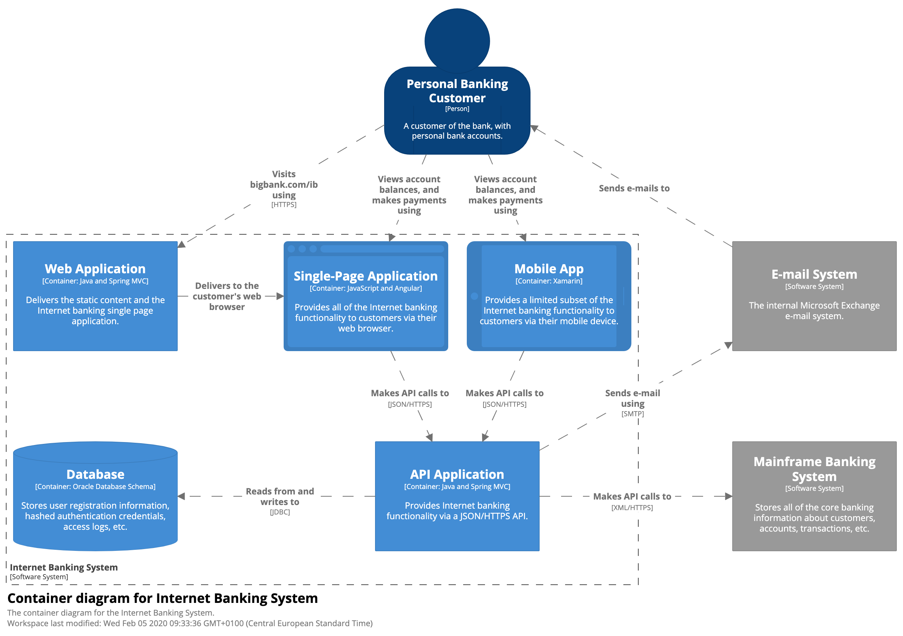
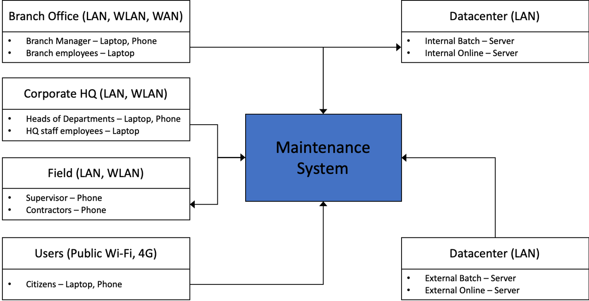

# Abstract

The software development requirements laid down by an organization are driven by domain knowledge towards the goal of achieving the "mission statement" of an organization. The software development team implements the requirements towards the goal of maximum server utilisation in a quick and an automated fashion. These goals are aligned only if the software development requirements are unambiguosly understood by both business organization and software development teams. The alignment of business and software development goals is even more necessary in today's era of microservices. While the software development team can achieve very high server utilisation by developing microservices ("single purpose" artefacts), the business organisation will define the boundary of microservice.

This article presents **PARL approach** to arrive at a definition of the microservice that brings the alignment of business and software development teams easily.

> **tl;dr** In PARL approach, a microservice is defined by business as *"Persona takes Action on a Resource from a Location"*. This definition helps a Software Architect to clearly lay out technical specifications for maximum server utilisation in the form of a microservice table. This microservice table helps a Developer implement the requirements into tangible entities.

- [Abstract](#abstract)
  - [Background](#background)
  - [PARL approach](#parl-approach)
  - [Building the PARL table](#building-the-parl-table)
    - [System Context diagram](#system-context-diagram)
      - [Entities](#entities)
      - [Action](#action)
    - [Container](#container)
      - [Resource](#resource)
    - [Location diagram](#location-diagram)
    - [Tabulation into PARL table](#tabulation-into-parl-table)
  - [Building the microservices table](#building-the-microservices-table)
    - [Roll-up into microservice(s)](#roll-up-into-microservices)
    - [Number assignment](#number-assignment)
    - [Microservice table](#microservice-table)
  - [Using the microservices table](#using-the-microservices-table)
    - [Defining the microservice with OAS](#defining-the-microservice-with-oas)
  - [Next steps](#next-steps)
  - [Summary](#summary)

## Background

Consider a large Government organisation that is embarking on a digital transformation journey to deliver better services to its citizens, enhance its relationship with its vendors and collaborate better with other organisations. This Government organisation starts its journey by inspecting all of its business processes for improvement. That inspection may result in shelving of some processes (or steps of it), enhancment of existing processes with sensor data, Machine Learning models, etc. or design of brand new business processes. The result of the inspection is handed over to software development organisation (in house or contracted out) for implementation.

The software development organisation focusses on implementing the requirements with maximum utilisation of server resources. To achieve high utilisation, the software development organisation has embraced (or embarked) on adoption of containerisation as its development approach. This adoption has resulted in a transformation that transcends tooling (DevOps, source control, binary repositories, issue management, etc.), software design and development (microservices, automated testing, infrastructure as code and so on) and even software management (automated issue management, release management, feature management and so on).

Naturally, the Government organisation and software development organisation should be in close alignment so that both are on track with their journeys. While there are methods and practices to enable this alignment, this article takes it to a level where this alignment is 'baked' into requirements gathering and software development processes.

Specifically, consider an initiative by the Government organisation to efficiently engage its contractors where, the process of work order allocation till disbursal of payment is to be streamlined. This process can cut across multiple departments of the organisation such as Engineering, Quality Control, Finance, Legal and so on. Clearly, this process is highly complicated as it has many stakeholders across all departments and the turn around time for this process may run into days. To streamline this complicated process with a 'big bang' approach would involve a long cycle of requirements gathering followed by development and testing. And, by the end of that cycle, it is likely that there are deviations from the original requirements. To minimise such changes to requirements, the organisations - Government and software development - agree to follow an agile approach where software is delivered in smaller pieces so that even if there are changes to the requirements, it is caught and fixed early on.

Soon, the agile approach results in a multitude of artefacts for both organisations that reduces visibility of the larger picture. More importantly, the governance of these artefacts, given their number, have to now span across automated testing and deployment. Here too, the management of multitude of artefacts is not unknown in the industry. However, the larger goal - the focus of this article - is to enable alignment and management of artefacts at the level of "narrowly defined" functionality. This enablement is offered by the **PARL approach** that allows the software development and Government organisations to "speak" the same language without getting into artefacts management.

## PARL approach

The PARL approach is summarised as:

- [Building the PARL table](#building-the-parl-table)
- [Building the microservices table](#building-the-microservices-table)
- [Using the microservices table](#using-the-microservices-table)

The PARL table has multiple rows that correspond to one simple rule at the most granular level of business processes. This rule is as follows.

> **P**ersona takes **A**ction on a **R**esource from a **L**ocation.

The microservice table builds upon the PARL table to provide an implementation view of granular business processes. The microservice table merges two or more rows of PARL table into one microservice. Finally, a deployment table builds upon the microservice table to provide a view of tangible artefacts that will run in product and is tied down to the rows of microservice table, and in turn the PARL table.

Therefore, the following are the artefacts of the PARL approach:

| Artefact name                 | Purpose                                                                                             | Owned by                          |
| ----------------------------- | --------------------------------------------------------------------------------------------------- | --------------------------------- |
| PARL Table                    | The usiness organization view of all business processes at their _most granular_ level.             | Business Organization             |
| Microservice Table            | The Software Development view, built on top of PARL table, for artefacts that need to be developed. | Software Design Organization      |
| _(Optional)_ Deployment Table | Merged version of PARL Table and Microservice Table for an end-to-end view.                         | Software Development Organization |

## Building the PARL table

As mentioned previously, the PARL approach builds upon the rule of *"Persona takes Action on a Resource from a Location"* at the most granular level of busines processes. The tabulation of the rule is acheived by answering the questions as shown in the table.

| **Persona**                | **Action**                     | **Resource**        | **Location**                |
| -------------------------- | ------------------------------ | ------------------- | --------------------------- |
| _Who accesses the system?_ | _How is the nature of access?_ | _What is accessed?_ | _Where is the access from?_ |

To build a PARL table, the following diagrams are required for a system that is to be designed. Refer [C4 Model](https://c4model.com) for description.

| Diagram            | Purpose                                                                                        |
| ------------------ | ---------------------------------------------------------------------------------------------- |
| **System Context** | Identify the entities that interact with a given system.                                       |
| **Container**      | Define various systems and interactions logically.                                             |
| **Deployment**     | Identify the access mode of a given entity where, mode is a combination of network and device. |

If these diagrams do not exist, then the required information maybe gathered from other sources that will answer the questions as shown in the previous table.

### System Context diagram

A *System Context diagram* presents the system and its interactions with its environment<sup>1</sup>. When drawing or interpreting this diagram, the key point is to enumerate the entities that will interact with the system _and_ the nature of the interaction. Note, the _target_ of interaction is documented within a Container diagram. For complex systems, a study of the Container diagram can reveal the target(s). Otherwise, it should be inferred from other sources of information.


In the diagram (from [here](https://c4model.com/img/bigbankplc-SystemContext.png)) above, the dashed line is the enterprise boundary which is accessed by an entity **Personal Banking Customer**. Notice, how the nature of action - **Views account balances and makes payments** is also called out in this diagram. However, in PARL approach, this should be broken down into a much granular level as applicable.

Further, from this diagram, the Entity is the **Personal Banking Customer** and the **Actions** are viewing balances and making payments. The following sub-sections describe Entities and Action as interpreted from the System Context diagram.

#### Entities

Consider an entity who is a human user that interacts with a system developed for a Government organisation. This human user could be a citizen, an employee of a department of this Government organisation, an employee of _other_ department of the same Government organisation, a user from an _altogether different_ Government organisation, such as a regulator, etc. Further, human users such as contractor or a visitor maybe provided temporary access. Finally, there maybe overlapping roles where, an employee of the Government organisation may access the system as a citizen, etc.

Even system accesses should also be similarly enumerated. For example, this system may post daily data in batch to another - external or internal - system. Or, an external system may invoke a REST API of this system for look-up, updates, etc.

These entities - human or system - is referred to in this article as **Persona** and is a key list that should be extracted from the System Context diagram.

> As the organization matures in its journey of transformation, it is indeed possible, that a microservice designated in the PARL table may itself become an Entity.

#### Action

For a given pair of Persona and [Resource](#resource), the nature of **Action** is an indicator of the access level assigned to that Persona corresponding to a Resource. For example, a customer facing executive may input service requests into the system, but, the approvals may be provided by other personnel only. Similarly, multiple systems - external or internal - may be given access to look-up information but no system may update this information or update selective information, etc.

In simple terms, every pair of Persona and [Resource](#resource) should be co-related with an action as shown below.

- Adding a resource i.e. `CREATE`.
- Looking-up or browsing resources i.e. `READ`.
- Altering a resource i.e. `UPDATE`.
- Removing a resource i.e. `DELETE`.

The name of actions above are illustrative only. They could be more descriptive such as `createTicket`, `readSevereIssues`, `updateTimeline`, `deleteObsolete`, etc. The key point to keep in mind is that all actions fall in one of `CREATE`, `READ`, `UPDATE` and `DELETE` operations *only*.

In practice, though, there will be variants of every action. For example, creation of a resource may have variants depending on attributes of a resource. Consider a mobile phone subscriber who wants to create a new subscription based on a plan of his/her choice. It is possible that the business logic to create this subscription will follow different paths based on chosen plan. It is likely that, the creation of variants of subscriptions may not be considered unqiue by the business organization. Therefore, these variants may not appear in the PARL table. However, when implementing the creation of subscription for the combination of mobile phone subscriber (Persona), the plan (Resource) and creation of subscription (Action), the developer may implement different end-points in the same microservice. For example, an end-point `/subscription` may implement the creation of subscription with a default plan. Whereas, the `/subscription/{subscriptionId}` end-point may implement the creation of a subscription with the `subscriptionId` plan and so on.

Similarly, a manager who oversees the provisioning of mobile phone subscriptions may want to browse the trend of subscriptions. Clearly, this information can be delivered with a microservice for the combination of manager (Persona) browsing (Action) the subscriptions (Resource). However, when implementing this microservice, multiple end-points may exist to supoort browsing by attributes such as time range, subscription Id, subscription value or a combination of these. For example, `/subscription/{subscriptionId}`, `/subscriptions?fromDate=ddmmyy&toDate=ddmmyy`, etc. In this case too, it is likely that, the business organization may not consider the various ways of browsing subscriptions as unique. Therefore, these operations may not appear in the PARL table.

Finally, in both of the examples above, a final call maybe taken before building the [microservice table](#building-the-microservice-table) on whether handling of variants should be a separate microservice or could be implemented as different end-points in the same microservice. This call can be taken on various factors such as free vs premium features, frequency of invocation, etc.

### Container

The Container diagram will describe various servers (and their interaction) including data stores. For the PARL table, the servers of interest are the ones denoting the target of interaction.



In the diagram (from [here](https://c4model.com/img/bigbankplc-Containers.png)) above, we see multiple applications that the Personal Banking Customer will interact with for his/her Actions. Of particular interest in this diagram is the database component because that is the target of Actions.

From this diagram, the Resource is the **Database** that stores information on User registration. The **Mainframe Banking System** is also the Resource even though it is outside the enterprise boundary. This is an important observation because, from a business organization stand-point, the enterprise boundary only separates the new system to be developed and the one that is already existing.

#### Resource

Once the Personae have been enumerated, for every Persona, a list of all resources that it can access should be enumerated. For example, while a Head of Department will have access to financial data, a citizen will have access to his/her service requests only. Thus, the persistence layer that will hold the financial data and the service requests will be treated as the **Resource**. In software terms, such Resource would mostly manifest itself as a database table, cache, master data repository, etc.

A list of Resources mapped to every Persona is the next key list to be prepared. **Note** that, it is likely that the Resource may be defined in the Container diagram for complex systems.

### Location diagram

In today's era, the mode of access is an important factor where, the mode is a combination of device and network. For example, a user may have a work laptop and a smartphone - own or company issued - to access a system over different networks. These networks could be LAN and WLAN in a corporate setting or a home network. Or, it could be public WiFi or a 4G connection.

Certain organisations may have policies to restrict access based on network-device combination. For example, a field executive maybe allowed to publish or access reports from any network as long as he uses a corporate issued device. Similarly, an employee maybe allowed to access email only from a corporate issue device _and_ connected over VPN, etc.

Such a mapping of Personae and **Location** is typically documented in a Location diagram.



In the diagram above, the persona, their physical location and their mode of access in terms of network and device have been called. For example, senior management can access maintenance system over phone and laptop. The phone and laptop are assumed to be corporate issued. Similarly, the supervisors can access the maintenance system with a corporate issued phone over a 4G network, and so on.

### Tabulation into PARL table

With the information gathered from all the diagrams, a PARL table is constructed as shown below. Note that, it is quite possible to have multiple PARL tables for complicated projects. In such cases, the PARL tables should be named uniquely and unambiguosly. See [number assignment](#number-assignment) below.

| **Persona**                  | **Action**                     | **Resource**                 | **Location**                                     |
| ---------------------------- | ------------------------------ | ---------------------------- | ------------------------------------------------ |
| _Who accesses the system?_   | _How is the nature of access?_ | _What is accessed?_          | _Where is the access from?_                      |
| _Use System Context diagram_ | _Use Container Diagram_        | _Use System Context diagram_ | _Use Location diagram_                           |
| Head of Department           | `DELETE`                       | Purchase Order               | Corporate LAN, WLAN from corporate issued laptop |
| Citizen                      | `READ`                         | Press releases               | Public WiFi, 4G from any device                  |
| Vigilance Department Head    | `READ`                         | Financial Data               | Corporate LAN from designated server             |
| Customer Service Desk        | `CREATE`                       | Service Requests             | Corporate LAN from designated desktop            |
| Supervisor                   | `UPDATE`                       | Override actions             | Public WiFi, 4G from corporate issued smartphone |

## Building the microservices table

A microservice table is built using the PARL table. While the PARL table describes the combination of Persona, Action, Resource and Location in its most granular level, the microservice table focuses on implementation. Specifically, the microservice table helps map the number of rows in the PARL table into number of microservices, where the number of microservices is less than or equal to number of rows in PARL table. The microservice table serves as the common reference for both business and software development organizations.

The microservice table is built with the following two steps.

1. Roll-up (two or more) rows of PARL table, if required, into a microservice
2. Assign a unique name (or number) to designate the microservice

### Roll-up into microservice(s)

Once the PARL table is built, then every row of the PARL table can be an individual microservice. In practice, though, it is quite likely that, two or more rows of the PARL table can be deployed together as an individual microservices. For example, for a particular combination of Persona and Resource, all rows (i.e. Actions and Locations) could be rolled up as a single microservice. Similarly, for a particular combination of Persona and Resource two different microservices maybe developed to handle the `READ` and other actions from every location.

One way to translate the number of rows in PARL table into number of microservices could be assigning a number of invocations for every row of the PARL table. Certain rows of the PARL table may also be designated as premium or free microservice(s). Alternatively, rows for mobile-only features maybe left as unique microservices. An over-arching guideline to be followed is the overhead that will be incurred when dealing with a large number of microservices. This overhead could be in terms of developer head count, delivery timeline, infra-structure tooling (CI/CD support, etc.) and most importantly overall system performance.

Regardless of which approach is used for translation of PARL table into number of microservices, an unambiguous mechanism to corelate the two is needed. This article proposes a simple naming convention to uniquely identify the rows in the PARL table and corresponding microservice(s).

### Number assignment

> This article does not mandate a particular scheme of numbering. However, this article does propose _one possible_ way to number the microservice.

To begin with, start with a simple name or number to the PARL table. One way of naming the PARL table could be to use a hierarchical system such as `programName.projectName.systemName.PARL#n` or `programName.projectName.systemName.PARL#alphanum` where, `#n` is an integer starting from `1` and `#alphanum` is any string.

Another approach for naming the table is to loosely follow the convention followed by well known repositories such as GitHub, etc. The advantage of this approach is the familiarity with the naiming convention and also, possibly, an automatic hint towards where the PARL table is hosted. For example, the PARL table could be named as `systemName/PARL#alphanum` to indicate that, there is a GitHub repository named `systemName/PARL` with a branch `alphanum` where the table for features of `alphanum` is hosted. In an extreme case, where the entire PARL table is developed as a single microservice, a naming convention such as `systemName/PARL:alphanum` can be followed to mimic the image naming convention at Docker Hub.

In either case, the guideline to be followed is to use this name across _all_ artefacts that will be developed. These artefacts could be OpenAPI sepcification document (in JSON or YAML), a Docker image, JIRA issues, etc. Thus, this name should adhere to as many syntax and semantic requirements as possible. For example, some artefacts may not allow a `/` in their names, etc.

Once the table name is finalised, a microservice is numbered by suffixing `#n` to the table name. This number maybe repeated against all the rows in the PARL table that roll up to this microservice.

### Microservice table

Using the table from the [Tabulation into PARL table](#tabulation-into-parl-table) section, the microservice table is rewritten using table name as `systemName/PARL#webapp`. It is assumed that, this PARL table is hosted at a GitHub repo e.g. `https://github.com/systemName/PARL` on the `webapp` branch.

| **Microservice**           | **Persona**                   | **Action** | **Resource**     | **Location**                                     |
| -------------------------- | ----------------------------- | ---------- | ---------------- | ------------------------------------------------ |
| `systemName/PARL#webapp#1` | Head of Department            | `CREATE`   | Approval         | Corporate LAN, WLAN from corporate issued laptop |
| `systemName/PARL#webapp#1` | Head of Department            | `DELETE`   | Purchase Order   | Corporate LAN, WLAN from corporate issued laptop |
| `systemName/PARL#webapp#2` | Citizen                       | `READ`     | Press releases   | Public WiFi, 4G from any device                  |
| `systemName/PARL#webapp#2` | Citizen                       | `READ`     | Service requests | Public WiFi, 4G from any device                  |
| `systemName/PARL#webapp#3` | Vigilance Department FTP site | `READ`     | Financial Data   | Corporate LAN from designated server             |
| `systemName/PARL#webapp#4` | Customer Service Desk         | `CREATE`   | Service Requests | Corporate LAN from designated desktop            |
| `systemName/PARL#webapp#5` | Supervisor                    | `UPDATE`   | Override actions | Public WiFi, 4G from corporate issued smartphone |

Note that, the PARL table had seven rows in all whereas, the microservice table (above) has 5. This is because, `systemName/PARL#webapp#1` and `systemName/PARL#webapp#2` microservices together map 4 rows of the PARL table.

## Using the microservices table

While the microservice table defines the requirements unambiguously, the table is not a technical specification document. For example, the table does not describe the semantics of a `CREATE` action. This article chooses OpenAPI specification to convert the microservice table into a technical specification.

> The OpenAPI Specification (OAS)<sup>2</sup> defines a standard, language-agnostic interface to RESTful APIs which allows both humans and computers to discover and understand the capabilities of the service without access to source code, documentation, or through network traffic inspection.

The current version is `3.0.3`<sup>3</sup>.

To connect a row from the microservice table with the OpenAPI specification, the value of `title` is set to the microservice number from the microservice table. Further, the `operationId` can be set to the microservice name followed by a period and an arbitrary string to differentiate end-points (or variants of an Action) of the microservice.

Consider the following sample of the `path` object defined in OAS as JSON.

```json
{
  "/pets": {
    "get": {
      "description": "Returns all pets from the system that the user has access to",
      "responses": {
        "200": {
          "description": "A list of pets.",
          "content": {
            "application/json": {
              "schema": {
                "type": "array",
                "items": {
                  "$ref": "#/components/schemas/pet"
                }
              }
            }
          }
        }
      }
    }
  }
}
```

In the sample, the `path` object points to `/pets` and the `get` operation. The `/pets` and `get` are respectively *Resource* and *Action* in PARL table. Clearly, the *Persona* and *Location* are not called out.

### Defining the microservice with OAS

Often OAS documents cover _all_ paths and _all_ resources. Whereas, from the microservice table, an OAS document should be created for _every_ microservice. Consider the microservice `systemName/PARL#webapp#2`. The OAS document for it can be described as shown below.

```yaml
swagger: "3.0.1"
info:
  description: "This microservice allows citizens to read press release and browse Service Requests"
  version: "1.0.0"
  title: "systemName/PARL#webapp#2"
host: "orgName.systemName.com"
basePath: "/api/v1"
schemes:
- "https"
paths:
  /notice:
    get:
      summary: "Read latest press release"
      description: "A citizen can read the latest release as published by this department"
      operationId: "systemName/PARL#webapp#2.1"
      produces:
      - "application/json"
      responses:
        200:
          description: "Notice retrieved"
          schema:
            type: "object"
  /notice/type:
    get:
      summary: "Read press release by type."
      description: "Read press release by type. Valid values are: weather, holiday and lawenforcement"
      operationId: "systemName/PARL#webapp#2.2"
      parameters:
      - name: noticeType
        in: query
        required: true
        schema:
          type: array
          items:
            type: string
            default: holiday
            enum:
              - holiday
              - weather
              - lawenforcement
      produces:
      - "application/json"
      responses:
        200:
          description: "Notice retrieved by type"
          schema:
            type: "object"
  /serviceRequest:
    get:
      summary: "Show all service requests"
      description: "Show all service requests of a user upto 3 months"
      operationId: "systemName/PARL#webapp#2.3"
      produces:
      - "application/json"
      responses:
        200:
          description: "Service requests of a user"
          schema:
            type: "object"
  /serviceRequest/{serviceRequestId}:
    get:
      summary: "Show a service request"
      description: "Show a service request in detail"
      operationId: "systemName/PARL#webapp#2.4"
      parameters:
      - name: serviceRequestId
        in: path
        required: true
        schema:
          type: integer
          format: int64
      responses:
        200:
          description: "Service request detail of a service request if of a user"
          schema:
            type: "object"
```

Notes:

1. The microservice name `systemName/PARL#webapp#2` is called out in the `title` key.
2. Since `systemName/PARL#webapp#2` in microservice table covers only `READ` Action, the OAS document mentions only `get` operation.
3. Since `systemName/PARL#webapp#2` in microservice table covers notices and service requests, the OAS document mentions path for notices and service requests.
4. A variant of retrieving notices is by the type of notice. Since this variant is not considered a different resource, it appears in this microservice definition.
5. The variant of retrieving notices by type is differentiated by the `operationId` key.

## Next steps

Till this point, this article has described the PARL approach to align the business and software development teams with the following steps.

1. Create the PARL table
2. Create the microservice table from the PARL table
3. Create specification from the microservice table

As next steps, servers should be implemented with the created specification. This article used the OAS to generate the specification for the microservice table. The OAS can be fed into a code generator such as [Swagger Codegen](https://swagger.io/tools/swagger-codegen/) to generate the skeleton for microservice.

With the microservice completely developed, it can be converted into a Docker image and deployed into a Kubernetes cluster. To see an end-to-end view, a **Deployment Table** can be drawn to corelate the microservice and the deployed image. The **Deployment Table** is not a mandatory component of **PARL approach**. Nevertheless, it helps in putting in an end-to-end perspective from requirements to unit of deployment.

| **Docker image**          | **Microservice**           | **Persona**                   | **Action** | **Resource**     | **Location**                                     |
| ------------------------- | -------------------------- | ----------------------------- | ---------- | ---------------- | ------------------------------------------------ |
| `systemName/webapp-1:tag` | `systemName/PARL#webapp#1` | Head of Department            | `CREATE`   | Approval         | Corporate LAN, WLAN from corporate issued laptop |
| `systemName/webapp-1:tag` | `systemName/PARL#webapp#1` | Head of Department            | `DELETE`   | Purchase Order   | Corporate LAN, WLAN from corporate issued laptop |
| `systemName/webapp-2:tag` | `systemName/PARL#webapp#2` | Citizen                       | `READ`     | Press releases   | Public WiFi, 4G from any device                  |
| `systemName/webapp-2:tag` | `systemName/PARL#webapp#2` | Citizen                       | `READ`     | Service requests | Public WiFi, 4G from any device                  |
| `systemName/webapp-3:tag` | `systemName/PARL#webapp#3` | Vigilance Department FTP site | `READ`     | Financial Data   | Corporate LAN from designated server             |
| `systemName/webapp-4:tag` | `systemName/PARL#webapp#4` | Customer Service Desk         | `CREATE`   | Service Requests | Corporate LAN from designated desktop            |
| `systemName/webapp-5:tag` | `systemName/PARL#webapp#5` | Supervisor                    | `UPDATE`   | Override actions | Public WiFi, 4G from corporate issued smartphone |

The first two columns is the view of the software development team and the rest of the columns is the view of the business organization.

## Summary

This article presented the **PARL approach** to align the business organization and the software development team. The **PARL table** developed, from the **PARL approach**, covers the requirements in the most granular level. Then, the **microservice table** translates the number of rows in the **PARL table** into number of microservices to be developed. Finally, the **deployment table** provides an end-to-end view of the development cycle in terms of unit of deployment and the granular requirement served by it.

END.
